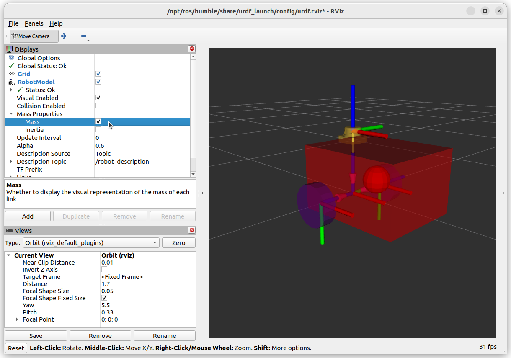

Adding Collisions and Inertia
===============================

In it's current form, the URDF file is perfectly serviceable for real hardware.  Links can contain additional *Collision* and *Inertial* information, these are primarily needed for simulations.

For more information, it is highly recommended you visit the official documentation about `URDF Links <http://wiki.ros.org/urdf/XML/link>`_.

Collisional Information
------------------------

For Boxes, Cylinders and Spheres, the same primitive geometry can be used for collisions and inertia.  An example would be the box for the base_link:

.. literalinclude:: ../../ros_ws/src/example_urdf_description/urdf/diff_drive_collision_primitive.urdf
    :language: xml
    :lines: 11-29
    :lineno-start: 11
    :linenos:
    :emphasize-lines: 12-18

For meshes, the additional computation required to compute a collision for all the additional vertices is usually not worth it, compared to the quicker calculations for a more simple primitive.  The general rule is, *unless you have a really good reason not to*, use a primitive for collision calculations.

.. literalinclude:: ../../ros_ws/src/example_urdf_description/urdf/diff_drive_collision_primitiveandmesh.urdf
    :language: xml
    :lines: 31-48
    :lineno-start: 31
    :linenos:
    :emphasize-lines: 12-17

.. image:: ../../figures/week07/rviz_collisionmesh.png
    :width: 800
    :alt: RVIZ screen capture of a mesh, using a cylinder primitive as a collision geometry.
    :align: center 

The picture above shows how a cylinder can be used to surround the mesh file as a suitable alternative to the mesh itself.  Note that a box may have been more suitable in this instance, however, we had already used a box for the base_link!

Inertial Information
------------------------

This information is a bit tricker.  Moments of inertia are defined around orthogonal axes, producing a :math:`3 \times 3` matrix (see below).

.. math::

   \begin{bmatrix}
    I_{xx} & I_{xy} & I_{xz} \\
    I_{yx} & I_{yy} & I_{yz} \\
    I_{zx} & I_{zy} & I_{zz} 
    \end{bmatrix} 

For simple shapes (Cylinders, Boxes, Spheres), the moment of inertia is easily written and calculated (see `wikipedia <https://en.wikipedia.org/wiki/List_of_moments_of_inertia#List_of_3D_inertia_tensors>`_ for examples).

Below is the example for the base_link box, which has the centre of mass at the centre of the cube **not** the origin.  The mass of the base_link is taken to be 12kg (if you wish to calculate the coefficients for yourself).

.. literalinclude:: ../../ros_ws/src/example_urdf_description/urdf/diff_drive_inertia.urdf
    :language: xml
    :lines: 11-27
    :lineno-start: 11
    :linenos:
    :emphasize-lines: 12-16

The centre of mass of the base_link box is shown as a sphere.  This view can be enabled in RVIZ using the ``Mass Properties`` options.  Enabling the ``Inertia`` option will show a cube which perfectly aligns with the visuals.

Remember that the collision and inertia information will become more important when we use this information for simulations.

.. DANGER::

    For meshes, CAD programs etc can be used to calculate the moments of inertia, but they sometimes use a different formulation!  See the `official documentation <http://wiki.ros.org/urdf/XML/link>`_ for details.  Some CAD software don't even calculate it correctly!  **DOUBLE DANGER!**

    If in doubt, it is better to approximate the system as a primitive shape and use that instead.

