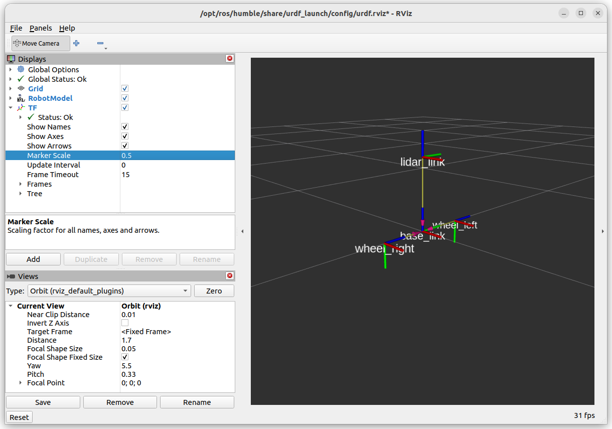

Adding Joints
=====================

Let's build a simple differential drive robot with two continuous joints for wheels and fixed joints for a castor wheel (sphere) and a lidar.

.. image:: ../../figures/week07/URDF_Example_Robot.png
  :width: 800
  :alt: Schematic of simple differential drive robot.
  :align: center 

Make a New Package
-------------------

Start by creating a new ament-python package called ``example_urdf_description`` in a ROS2 workspace, adding a directory called ``/urdf``, then making a blank file ``diff_drive.urdf``.

.. code-block:: console
    
    ros2 pkg create example_urdf_description --build-type ament_python --license BSD-3-Clause --description "Description package for an example diff. drive robot"
    mkdir example_urdf_description/urdf
    touch example_urdf_description/urdf/diff_drive.urdf

We will also be using meshes in this tutorial, so create a ``/meshes`` directory also.

.. code-block:: console
    
    mkdir example_urdf_description/meshes

Don't forget to add the reference to the urdf and meshes directories and their files in ``setup.py`` :

.. literalinclude:: ../../ros_ws/src/example_urdf_description/setup.py
    :language: xml
    :emphasize-lines: 1,2,15-18
    :linenos:

Writing the First Fixed Joint
------------------------------

Using your code editor of choice and open the ``diff_drive.urdf`` file which was just created.  Add the following code:

.. literalinclude:: ../../ros_ws/src/example_urdf_description/urdf/diff_drive_1.urdf
   :language: xml
   :linenos:

There are two *links* (think of these as seperate coordinate frames), connected by a single fixed *joint*.  The child link ``lidar_link`` is 0.3 m (30 cm) in the positive z direction compared to the parent link ``base_link``.

Inspecting the URDF
~~~~~~~~~~~~~~~~~~~~~~

It is incredibly easy to create a typo when writing in <tags></tags>.  Therefore, always check for errors using automated tools.  There are xml validators/checkers available online, however, ROS provides a urdf checker.  Navigate to where the .urdf file is and run the ```check_urdf /path_to_file/name_of_file.urdf```.

.. code-block:: console

    cd <WORKSPACE>
    check_urdf ./src/example_urdf_description/urdf/diff_drive.urdf

Once all errors have been corrected (it returns the robot name with ```---- Successfully Parsed XML ----```, you can move on to visualising the robot model.

Navigate to your ROS2 workspace and perform a colcon build, then run the urdf_launch utility:

.. code-block:: console

    colcon build --packages-select example_urdf_description
    ros2 launch urdf_launch display.launch.py urdf_package:=example_urdf_description urdf_package_path:=urdf/diff_drive.urdf

You should see an image like the one below.  Under "TF" in the left panel, it is possible to turn on the names of the links.

.. image:: ../../figures/week07/rviz_1.png
  :width: 800
  :alt: RVIZ screen capture of a single fixed joint.
  :align: center 


.. admonition:: Optional Activity
   :class: note

   Try changing the rotation of the child link using ``rpy``.  Each rotation is performed in that order relative to the parent link.
   
   Aim to have the +z child = +x parent, +y child = +z parent, +x child = +y parent.
   
   Hint, it can be acheived with two :math:`{\pi}/2`  rotations.


Adding Wheels (Continuous Joints)
----------------------------------

As you would have picked up from *EEEN62011 Robotic Systems* Wheels by convention rotate about their z-axis.  Firstly, ensure that the axis of rotation is about the z-axis using ``<axis xyz="0 0 1"/>`` and rotate the links relative to the base_link (hence the roll angle in the origin tag).

The wheels have a distance of 0.2m from the base_link along its y-axis.

Modify the ``diff_drive.urdf`` file with the following:

.. literalinclude:: ../../ros_ws/src/example_urdf_description/urdf/diff_drive_3.urdf
    :language: xml
    :emphasize-lines: 8,9,18-23,25-30
    :linenos:

Once again, we can check this is correct using RVIZ:

.. code-block:: console

    colcon build --packages-select example_urdf_description
    ros2 launch urdf_launch display.launch.py urdf_package:=example_urdf_description urdf_package_path:=urdf/diff_drive.urdf





In it's current state, this URDF file is good enough for performing coordinate system transformations with TF.  Next, we will add some visuals to make the description look more like an actual robot.
