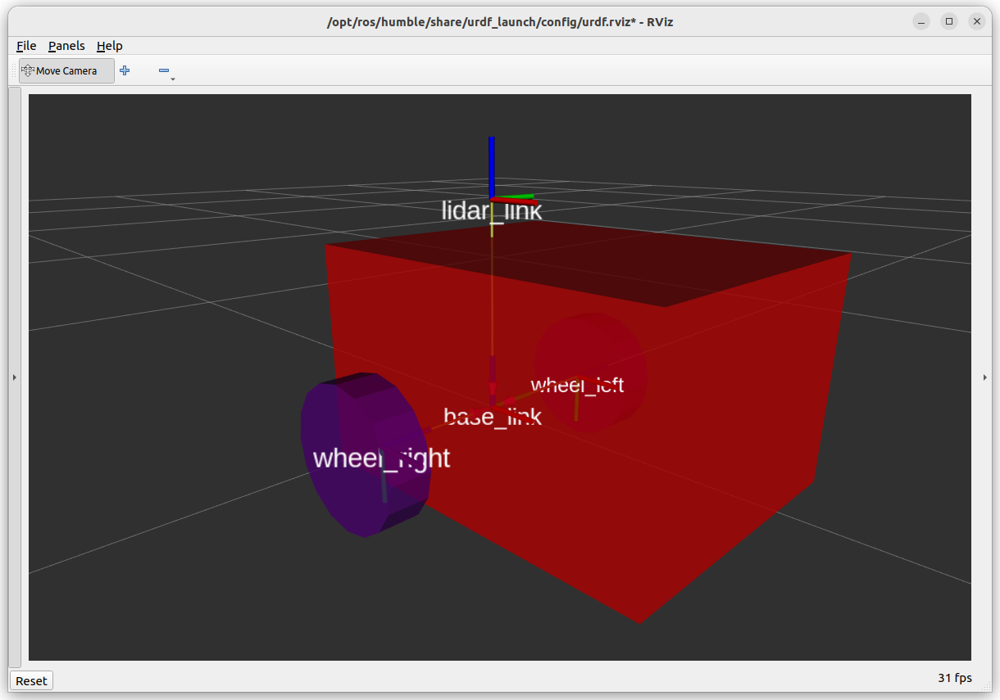

Adding Links
==================

The additional elements of a URDF link are all optional (visual, collison, inertial), but they are helpful in other ways beyond performing rigid body transformations.

.. admonition:: Story Time
    :class: note

    Humans rely on their vision for a lot of interpretation.  Adding visual indicators to our robot model can be incredibly beneficial.
    When deploying robots and trying not to crash into anything (such as a nuclear reactor), being able to see the chassis of a mobile robot or manipulator can genuinely be the difference between a good day and a very bad day.

Adding Visuals
-----------------

There are two primary ways to add visual elements to a URDF file, either through a simple primitive geometry (box, cylinder, sphere) or by adding a mesh file.  To save time, we will only explore the use of primitive geometries.

Adding a visual tag to the ``base_link``, the code below simply adds a ``box`` which is slightly offset from the ``base_link`` link.  Notice we swapped a single line ``<link name=""/>`` tag to instead use opening and closing tags ``<link></link>``.

.. literalinclude:: ../../ros_ws/src/example_urdf_description/urdf/diff_drive_4.urdf
    :language: xml
    :emphasize-lines: 6-16
    :linenos:

Let's keep *rolling* by modifying the wheel links, adding cylinders to represent the wheels.  Replace lines 19 and 20 with the code below.

.. literalinclude:: ../../ros_ws/src/example_urdf_description/urdf/diff_drive_5.urdf
    :language: xml
    :lines: 20-46
    :lineno-start: 19
    :linenos:

This time we have defined a colour for the link using the ``material`` tag.  The cylinders have been offset using the ``<origin>`` tag, so they are outside the base_link chassis, radius 0.1m and height 0.06m.

Rebuild the package. The resulting representation should look similar to that in the picture below.

Using a Mesh File
-------------------

Mesh files, such as an ``.stl`` file, can be used as a visual element.  This is great for more bespoke parts of a robot and a more accurate representation.

For the lidar, please download the file :download:`/meshes/Generic_100mm_lidar <../../ros_ws/src/example_urdf_description/meshes/Generic_100mm_lidar.stl>`, and copy it into the ``meshes`` directory.

This stl file will act as the visual element for the lidar, with more intricate features than a simple cylinder, box or sphere.

.. literalinclude:: ../../ros_ws/src/example_urdf_description/urdf/diff_drive_6.urdf
    :language: xml
    :emphasize-lines: 5-8, 23-33
    :linenos:

We have also added a specific material (``uom_yellow``) *outside* of tag, this means it can be reused elsewhere in the file. Rebuild the package to see image similar to below.

.. image:: ../../figures/week07/rviz_4.png
    :width: 800
    :alt: RVIZ screen capture including a lidar mesh element.
    :align: center 

Where is the Castor?
~~~~~~~~~~~~~~~~~~~~~
Including the castor (modelled as a sphere) will be left as a stretch task.  For now let's concentrate on the final aspects behind links.
