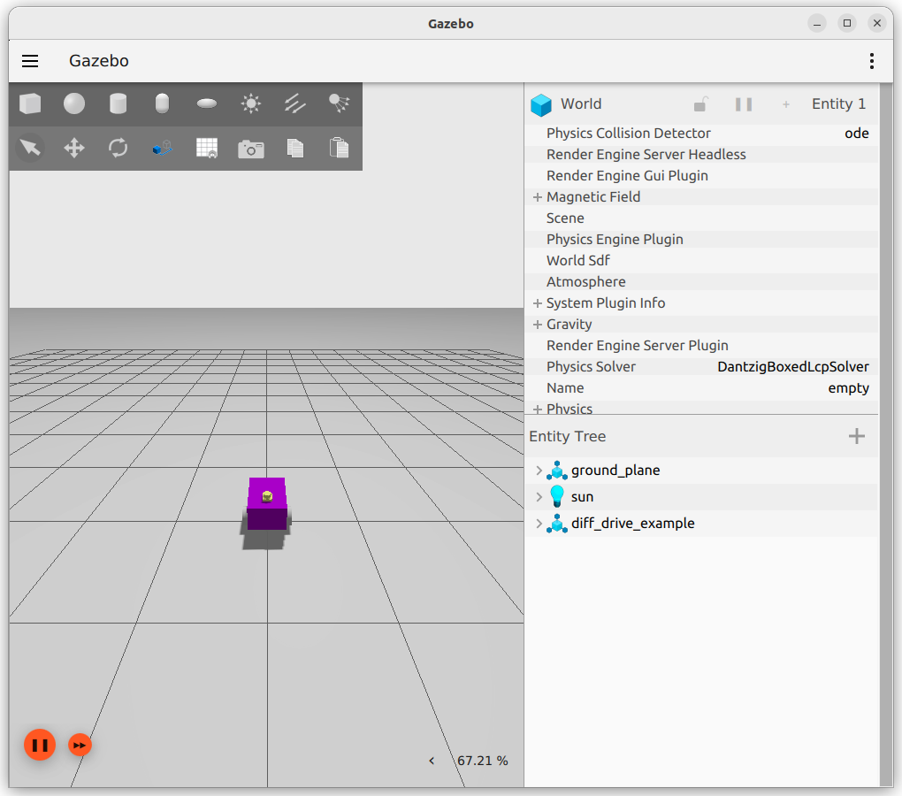
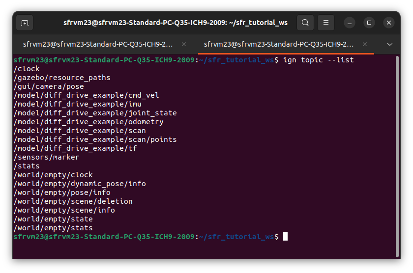
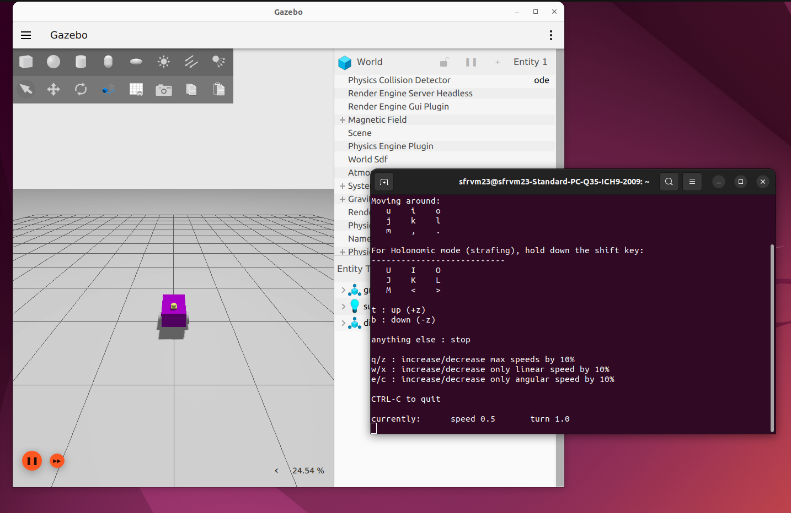
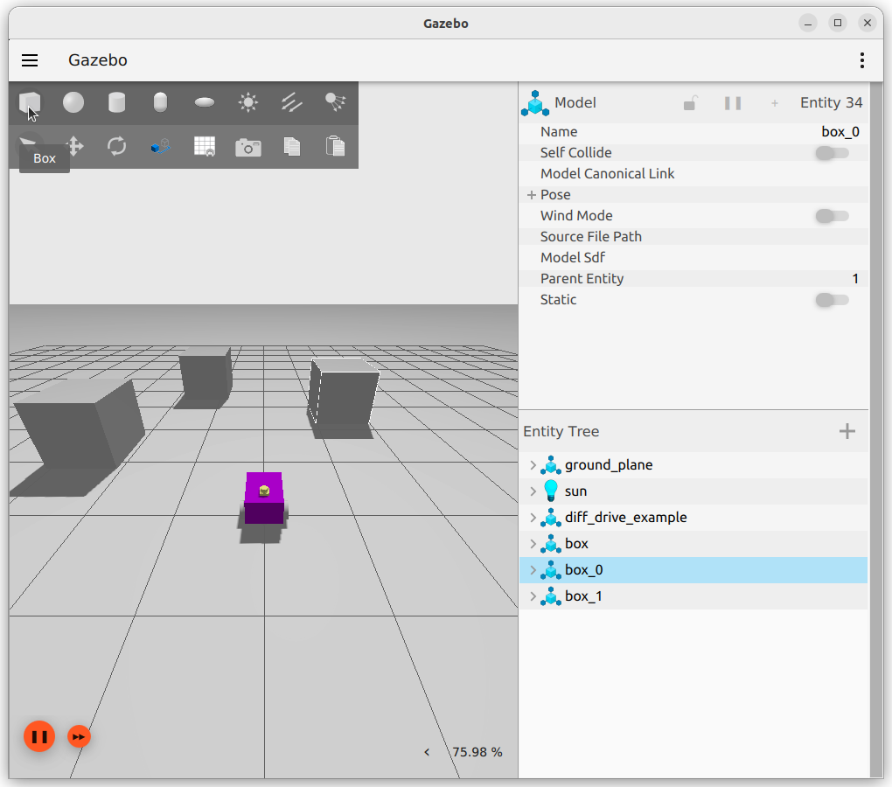
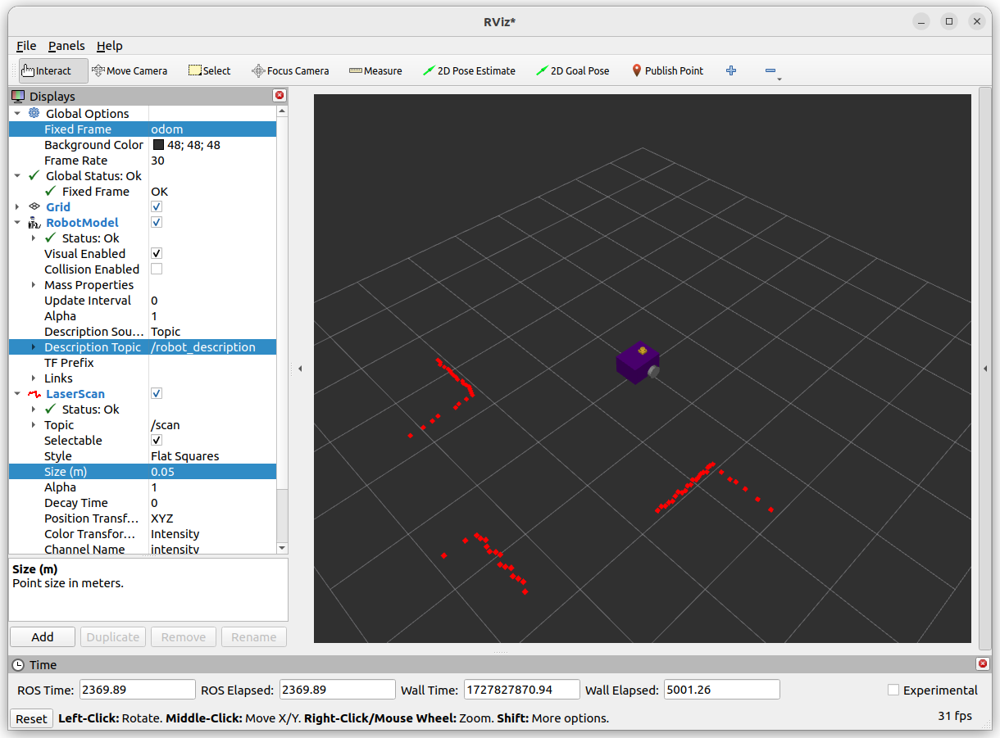

Linking Gazebo and ROS2
========================

This portion of the tutorial will guide you through how to connect the simulation to ROS.  This is the same for any simulation engine you might want to use (`Unreal <https://youtu.be/Ar0Ns4gVKME?feature=shared>`_, `Unity <https://unity.com/blog/engine-platform/advance-your-robot-autonomy-with-ros-2-and-unity>`_, `IsaacSim <https://nvidia-isaac-ros.github.io/getting_started/isaac_sim/index.html>`_)

Introspection of the Gazebo Simulation
-------------------------------------------------

Open a terminal with ``Ctrl+Alt+T`` and start a simulation containing the robot described by the xacro files covered so far:

.. code-block:: console

    cd ~/<YOUR_ROS_WORKSPACE>
    colcon build --packages-select example_urdf_robot
    ros2 launch example_urdf_robot sim_robot.launch.py

There will be two windows which open, Gazebo and RVIZ.  We will focus on Gazebo for the moment and return to RVIZ later.  The simulation should look similar to the image below.

Checking Gazebo Topics
^^^^^^^^^^^^^^^^^^^^^^

With the simulation successfully running, start a fresh terminal with ``Ctrl+Alt+T`` (alternatively the shortcut ``Ctrl+Shift+T`` to make a new tab, or use `terminator <https://ros2-tutorial.readthedocs.io/en/latest/terminator.html>`_), then run:

.. code-block:: console

    ign topic --list

The result should look similar to the picture below.

From the differential drive controller, the ``/model/diff_drive_example/odometry`` and ``/model/diff_drive_example/cmd_vel`` topics are present.  The joint state publisher is providing the ``/model/diff_drive_example/joint_state`` topic and it's information.  The ``/model/diff_drive_example/scan`` and ``/model/diff_drive_example/imu`` topics are provided by the lidar and imu sensor respectively.

A quick echo in the terminal can show that data is being produced by the simulation.  For example, try the command:

.. code-block:: console

    ign topic --echo --topic /model/diff_drive_example/odometry

The terminal should then respond with the pose and twist of the robot between the odom and base_footprint frames (the robot has not moved anywhere and is stationary, these should be approximately 0).  Press ``Ctrl+C`` to stop this output.

It is also possible to publish topics directly.  Try moving the robot with a terminal command:

 .. code-block:: console

    ign topic --pub "linear {x:0.5}" --topic /model/diff_drive_example/cmd_vel --msgtype ignition.msgs.Twist

Did it work? :code:`if(works){celebrate()}else{double_check_everything()}`

.. WARNING::
    Don't forget to stop the robot!
    
    .. code-block:: console
        
        ign topic --pub "linear {x:0.0}" --topic /model/diff_drive_example/cmd_vel --msgtype ignition.msgs.Twist

Bridge Between Gazebo and ROS2
--------------------------------

Right now, using the terminal to send commands to the robot is pretty rubbish, we want to leverage the power of the Robot Operating Sytem!

To enable this, we need to "bridge" between gazebo and ROS.  This is acheived via the ``ros_gz_bridge`` package.

The ``sim_robot.launch.py`` file shows how this is done.

.. literalinclude:: ../../ros_ws/src/example_urdf_robot/launch/sim_robot.launch.py
    :language: xml
    :lines: 55-79
    :lineno-start: 53
    :linenos:

The bridge can provide one-way (unidirectional) or two-way (bidirectional) sharing of topics between ROS and Gazebo.  The arguments are written as follows:

.. code-block:: python

    '/TOPIC_NAME_IN_GZ'  + '@ROS_MSG_PKG/msg/TYPE'   + 'DIRECTION' + 'ignition.msgs.TYPE',

The list of mapping from ROS msg to ignition msg can be found `here <https://github.com/gazebosim/ros_gz/tree/humble/ros_gz_bridge>`_.  Note that going forward, ignition.msg.Type will become gz.msg.Type for future Gazebo versions - this is likely what you might see in any very up-to-date tutorials.

The direction is declared with:

* ``[`` ROS<-GZ (Gazbeo "publishes" into ROS)
* ``]`` ROS->GZ (ROS "publishes" into Gazebo)
* ``@`` ROS<->GZ (both can publish into each other)

Using a unidirectional approach (square brackets) saves on bandwidth.  The line ``'/model/gz_example_robot/odometry' + '@nav_msgs/msg/Odometry'     + '[' + 'ignition.msgs.Odometry'``, therefore translates to a single combined string ``'/model/gz_example_robot/odometry@nav_msgs/msg/Odometry[ignition.msgs.Odometry'``, where odometry from gazebo is pushed into a ROS topic, but not the other way around.

The "remappings" decide what the topics names will be in ROS (e.g. just ``/cmd_vel``).

Using ROS Functionality
------------------------

As a trivial example, let's use ROS to publish twist commands to the simulation, mimicking the topics and input for a real robot.

In an available terminal (start a fresh terminal with ``Ctrl+Alt+T`` if necessary), run the teleop_twist_keyboard node from the teleop_twist_keyboard package using:

 .. code-block:: console

    ros2 run teleop_twist_keyboard teleop_twist_keyboard

Please note, you will need this terminal to be the active window to accept keyboard inputs.

As the robot is non-holnomic, do not press the shift key.  By pressing ``u`` the robot will move forward in a positive yaw arc, and *should* return to roughly where it started.  Play around with the controls to convince yourself there is a connection between ROS topics and the simulation.

Utilising Other ROS2 Tools - RVIZ
-----------------------------------

Add some shapes to the simulation, to give the lidar various surfaces to measure in the scene.  This can be achieved by using the box or cylinder buttons at the top left of the Gazebo window (see the image below).  Press the button (e.g. box) and then move your cursor around to place the shape on the ground plane.

Open RVIZ and make changes to the following settings in the left hand "Displays" panel:

#. Change Global Options -> Fixed Frame to *odom*
#. Add -> By Display Type -> RobotModel
#. Change Robot Model -> Description Topic  to  */robot_description* in drop-down menu
#. Add -> By Topic -> /scan
#. Change Laser Scan -> Size (m) to *0.05*

It should now be possible to view the readings from the lidar, along side a representation of the physical robot similar to the image below:

Though we are using RVIZ to demonstrate how ROS packages can be leveraged, now the Gazebo simulation is talking to ROS any package available to us can be utilised.
