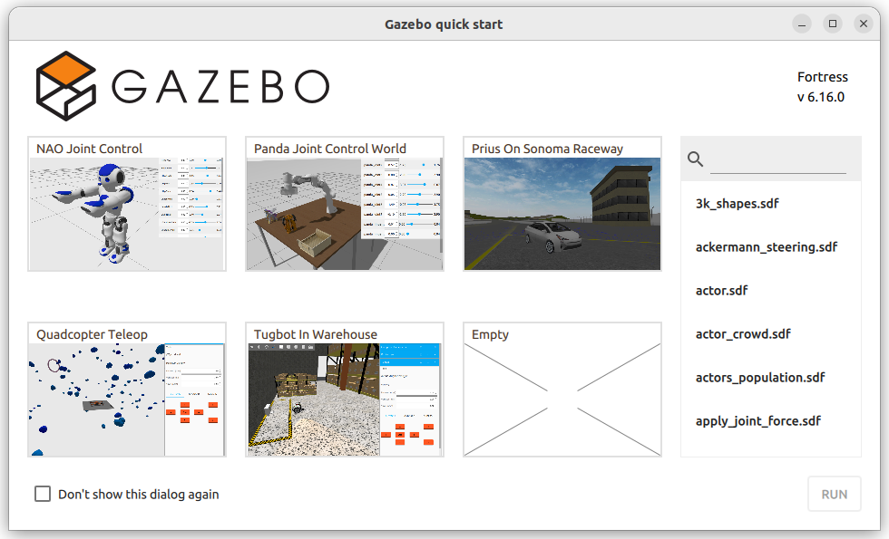
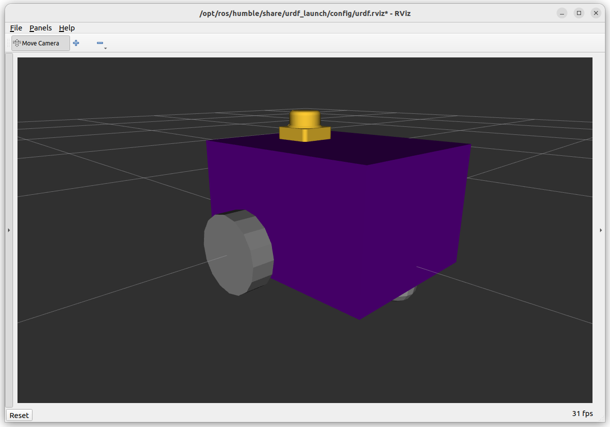

Setting Up a Simulation in Gazebo
=================================

The term "Gazebo" will be used to reference the Fortress version of `Ignition Gazebo <https://gazebosim.org/home>`_ which ships with ROS2 Humble.  Though technically it should be referred to as "Ignition Gazebo", who really cares?  The newer versions of Gazebo Sim have dropped the ignition branding, and the "old" verison of Gazebo is known as Gazebo Classic.

Check Gazebo is installed
----------------------------

When installing ROS2, it should have installed the "desktop-full" version which includes simulation tools like Gazebo.  As a test, try running:

.. code-block:: console
    
    ign gazebo

You should be greeted with a welcome screen like the one above.  If not, use the commands below to ensure everything is installed.

.. code-block:: console
    
    sudo apt install ros-humble-desktop-full

You can then check the installation with ``ign gazebo`` in the terminal as shown above.

.. Need to add ``export IGN_IP=127.0.0.1`` to .bashrc file.

.. WARNING::
    Nearly all tutorials you will find online are specifically for **Gazebo Classic** - we are at the cutting edge using Gazebo Sim/Ignition Gazebo.  Even the official documentation is pretty sparse.

    Furthermore, evidence\* has shown that using tools like ChatGPT for generating .urdf files is terrible, because it is so recent with limited online materials.

    \*Students using it last year and submitting horrible broken code

Using the .urdf files we made previously (see :doc:`Week 07 <../week07_tut_intro>`), we need to add some additional code to tell gazebo how things work.

Setup the ROS Package
-----------------------

Typically, for a robot there would be a ``<packagename>_description`` package (like the example_urdf_description from Week 07) which works with real and simulated versions, and a ``<packagename>_sim`` or ``<packagename>_gazebo`` package.

However, for convenience we will roll it all into one package called ``example_urdf_robot``.  To save time, a package has already been prepared as a zip file |example_urdf_robot.zip| - download it, extract it, and add it to your ros workspace.

.. |example_urdf_robot.zip| replace::
   :download:`example_urdf_robot.zip <../../ros_ws/src/example_urdf_robot.zip>`

This package includes a ``diff_drive.urdf.xacro`` file which will be focus of the next tasks.

To double check everything is working, perform a colcon build and run the urdf_launch utility:

.. code-block:: console

    cd ~/<YOUR_ROS_WORKSPACE>
    colcon build --packages-select example_urdf_robot
    ros2 launch urdf_launch display.launch.py urdf_package:=example_urdf_robot urdf_package_path:=urdf/diff_drive.urdf.xacro jsp_gui:=false

You should see something similar to the model in the picture below.

