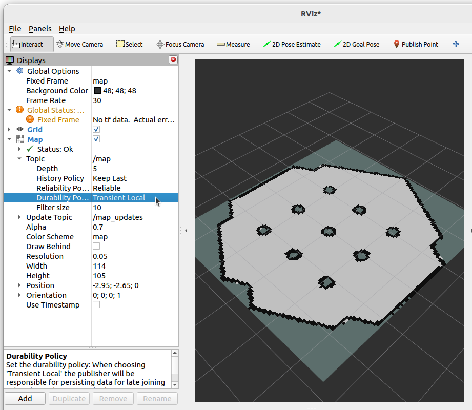

Maps and Occupancy Grids
=========================

The navigation stack relies heavily on so-called `costmaps <https://docs.nav2.org/concepts/index.html#environmental-representation>`_ (2D grids).  A core component is the "static" map, a representation of the world which can be used as a basis for path planning.  This needs to be provided either as a premade map, or generated in real time using SLAM (Simultaneous Localisation and Mapping).

.. Some other information `setup costmaps <https://docs.nav2.org/setup_guides/sensors/setup_sensors.html#costmap-2d>`_.

Though we will not delve deeper costmaps in this tutorial (that comes when we look at autonomous navigation), we will investigate the most basic map type, the occupancy grid.

The image below is an example of an occupancy grid image of a simulation environment.  The intention is the world looks like a turtle with the ROS 3x3 logo on it's back.

.. list-table::
   :width: 100%
   :class: borderless

   * - .. image:: ../../figures/week09/example_map.png
          :height: 250
          :alt: Example map of the Turtlebot3 world.
          :align: center
         
     - .. image:: ../../figures/week09/turtlebot_world.png
          :height: 250
          :alt: Turtlebot3 world in Gazebo Ignition simulator
          :align: center


The map image on the left has three colour values, the light grey repesents free space, the dark grey represents unknown, and black represents an obstacle.  By comparing to the world on the right, a robot inside the walled arena will see the obstacles whereas anywhere outside the arena is unknown.

Maps used for ROS are stored as .pgm files, with an accompanying .yaml file.  Below is an example of the .yaml file for the turtlebot3_world.pgm shown above, adapted from the Turtlebot3 simulation environment.

.. literalinclude:: ../../ros_ws/src/example_gz_robot/maps/turtlebot3_world.yaml
    :language: xml
    :linenos:

This .yaml file tells ROS what the image is called (``turtlebot3_world.pgm``) and how to convert pixels into metric space.  Resolution states how big a pixel is in metres (```resolution: 0.05``` is equivalent to 5 cm), and where is the origin of the map (top left pixel) with respect to a global coordinate system (``origin: ...``).  The values ``free_thresh`` and ``occupied_thresh`` are merely how to convert the greyscale colours to the three possible states.

Publishing an Existing Map with ROS
---------------------------------------

Suppose you have a warehouse, hospital, hotel, or any space which is well known and a robot is deployed in regularly.  There is no need to make map of the entire floor or building every time the robot runs, instead, it is better to load an existing map and publish it.

To save time, an existing package has been provided.  Please download :download:`example_gz_robot.zip <../../ros_ws/src/example_gz_robot.zip>`.  We will also be relying on the example_urdf_robot package made in Week 08.  You can download a complete version of that package here: :download:`example_urdf_robot.zip <../../ros_ws/src/example_urdf_robot.zip>`.

Extract these .zip files to your workspace of choice, perform a ``colcon build`` and ``source install/setup.bash`` as normal.

The package consists of a launch file called ``map_server.launch.py``, we will explore each part before using it.

.. literalinclude:: ../../ros_ws/src/example_gz_robot/launch/map_server.launch.py
    :language: xml
    :lines: 11-19
    :lineno-start: 11
    :linenos:
    :emphasize-lines: 6-8
    
We define the .yaml file of the map we wish to publish.  The .yaml and .pgm files should be in the same directory to avoid any issues.

.. literalinclude:: ../../ros_ws/src/example_gz_robot/launch/map_server.launch.py
    :language: xml
    :lines: 20-30
    :lineno-start: 20
    :linenos:
    :emphasize-lines: 3-9

The map_server node (provided by the ``nav2_map_server`` package) needs the filepath to the .yaml file as a parameter.  In ROS1 this would be enough, however, in ROS2 the map_server is a **managed** node (see `documentation here <https://design.ros2.org/articles/node_lifecycle.html>`_).  To save us manually changing the state of the node through the command line, we can leverage the ``lifecycle_manager``.

.. literalinclude:: ../../ros_ws/src/example_gz_robot/launch/map_server.launch.py
    :language: xml
    :lines: 31-44
    :lineno-start: 31
    :linenos:
    :emphasize-lines: 2-7

This use of the lifecycle node manager becomes very common when using the navigation stack, where a map needs to be published _before_ another node can use it. For Lifecycle manager to work correcty we need to install Nav2, using the command:

.. code-block:: console

    sudo apt install ros-<ros2-distro>-navigation2

To run the map server use:

.. code-block:: console

    source ~/<YOUR_ROS_WS>/install/setup.bash
    ros2 launch example_gz_robot map_server.launch.py

In another terminal perform the following:

.. code-block:: console

    source ~/<YOUR_ROS_WS>/install/setup.bash
    ros2 topic list

You should see the ``/map`` topic.  You could echo this to the terminal, but a list of 1, 0, -1 (obstacle, freespace, unknown) is not very helpful!  Instead, let us use RViz to see the map.

In the same terminal use:

.. code-block:: console

    ros2 run rviz2 rviz2

Add the ``/map`` topic and adjust the Durability Policy for the topic to "Transient Local".  You should see the map in RViz similar to the image below.



Now we can publish a map, let's make use of it!  Close all the windows and terminals and procede to the next section.
