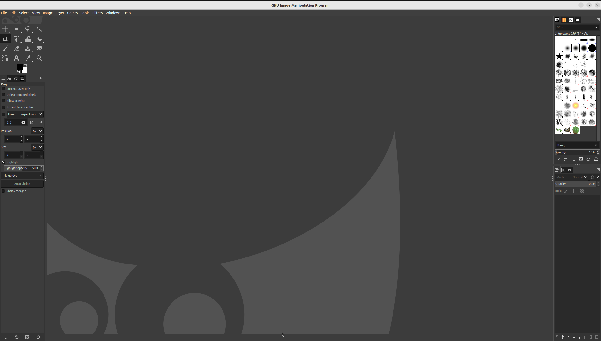
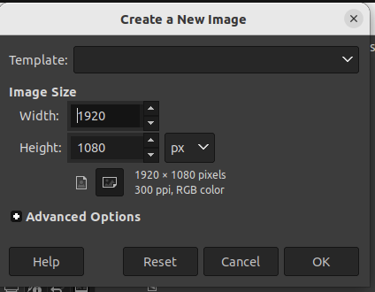
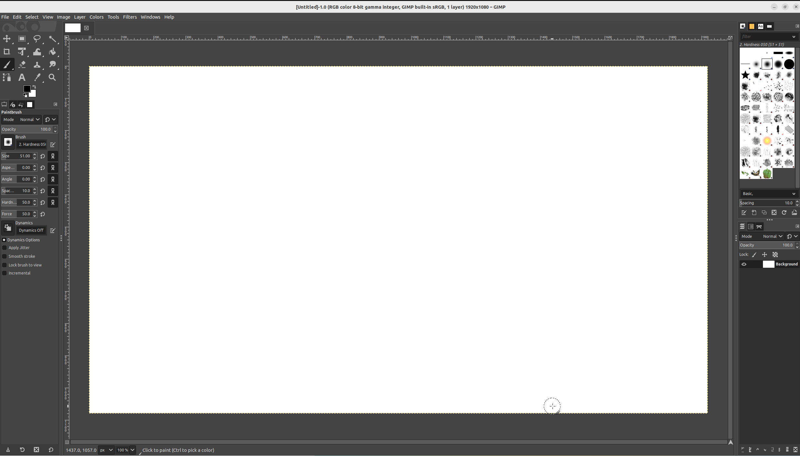
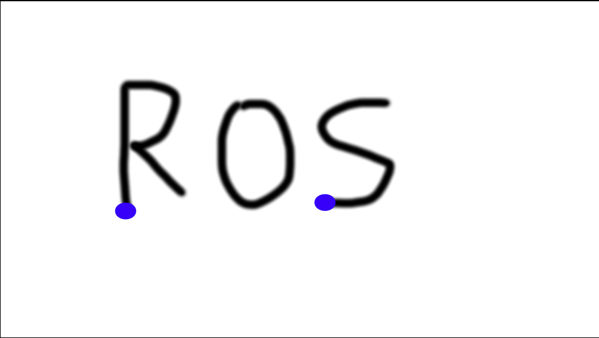
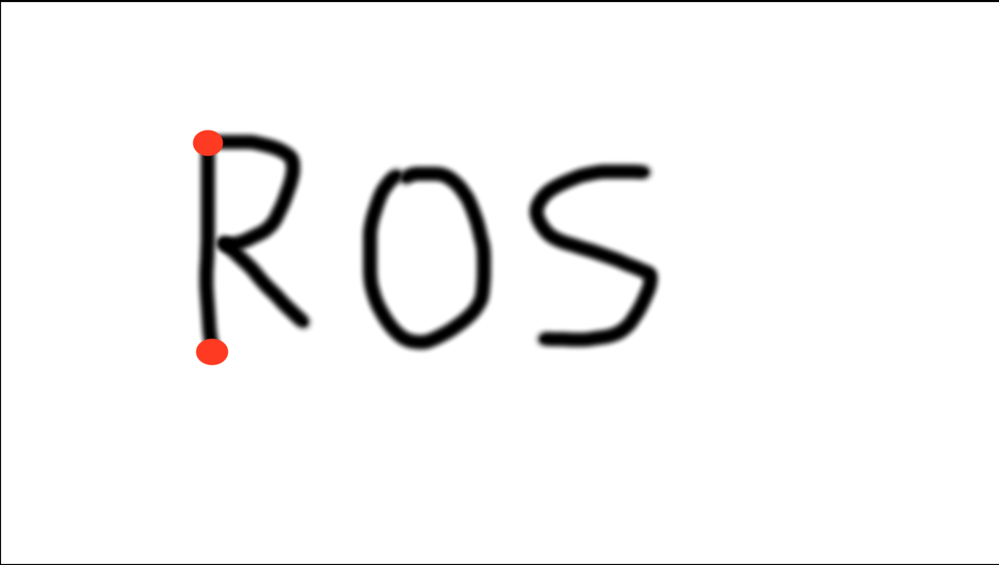
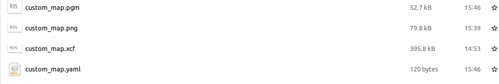

Maps creations
=========================

In the previous part of this tutorial you have been shown how to use existing map of an environment and how to create one by driving around in simulated world. Here we will show you how to create and import map into gazebo from nothing.

This skill is useful for example if you want to quickly test your robot in a new map or you collected LIDAR scan of real environment and you want to have in your Gazebo for testing.

Generally there are few ways you can go about it

 - Model your environment as .sdf
 - Model your environment in design software (such as solidworks) and export it as .stl file
 - Draw (or collected using real robot) your maps as .pgm, create assosciated .yaml file and convert those to .stl file.

In SfR module only third method is explored. In this method following steps are necessary

- Draw your map as .pgm in your favourite image creation tool (here GIMP will be used)
- Create assosciated .yaml and .pgn file (this can be done automatically using Python script)
- Create map .stl file using 'map2gazebo <https://github.com/Adlink-ROS/map2gazebo>' _ package
- Import into gazebo

Drawing the map
=========================

If you look inside .pgm file you will observe it is simply greyscale image with empty spaces represented by white colour and taken by black colour (for the sake of simplicty we will ignore unknown spaces, you are not required to know how to deal with those).

We can easily create such a picture using any graphical editing software. Here we will use GIMP. You can install GIMP by running:

.. code-block:: console
  sudo apt install gimp

Start gimp and you should see:

click *file* > *new* You should see:

just click *ok* to accept the default settings. You can now draw a simple map using paintbrush tool as highlighted in picture below. 

Just write ROS like so:

.. image:: ../../figures/week09/ROS_written.png
  :width: 800
  :alt: RViz screen capture of a published map.
  :align: center 

click *file* > *save* and save it in ``.../example_gz_robot/world/`` as custom_map.xcf. We also need to export to .png. to do this click *file* > *export*, Change file extension to *.png* like so:

.. image:: ../../figures/week09/Saving.png
  :width: 800
  :alt: RViz screen capture of a published map.
  :align: center 

Click *export* then *export* again in the pop-up window. This completes steps 1

Create .yaml and .pgm file
=========================

the .YAML file contains information which allows determination of size of the map (i.e. length of each pixel). While we could do it manually it is a lot more convinent to do so using a script. Please download `Download script <../../ros_ws
/src/MakeROSMap.py>`_ script and put it in ``.../example_gz_robot/world/`` directory. Open terminal in ``.../example_gz_robot/world/`` folder and type:

.. code-block:: console
  python3 MakeROSMap.py

This will open interactive command-line tool where you have to type the following:

.. code-block:: console
  custom_map.png

and press *Enter*

Now we have to select two x-coordinates and two Y coordinates for package to measure dimension. For x coordinate we want to select bottom of letter 'R' and 'S' as highlighted in picture below with red dots.

This does not have to be exact right. Once two x-coordinates are selected you should type 

.. code-block:: console
  4

and press *Enter*

To indicate we want this distance to be 4 meters. then the same with indicate Y-coordinates this time top and bottom of R as indicated in picture below.

We also type: 

.. code-block:: console
  4

and press *Enter*. then for question about the new name we just type:

.. code-block:: console
  custom_map

and press *Enter* twice. We should know see in Nautilus two new files being added, custom_map.pgm and custom_map.yaml, both needed by ROS.

Create .stl file
=========================

Now that we have map file we can use in map server, we also need to create assosciated .stl file for usage in Gazebo. STL files are 3D graphical files (you can find more info 'here <https://www.adobe.com/creativecloud/file-types/image/vector/stl-file.html>' _). So far we have 2D map only, we will create 3D equivalent by simply extruding walls from exisitng map. To do so we will use 'map2gazebo <https://github.com/Adlink-ROS/map2gazebo>' _ repository. To install follow the instruction from the repository. After installation we will be using offline instructions. Thus open new terminal in  ``.../example_gz_robot/world/`` folder and type in:

.. code-block:: console
 python3 ~/map2gz_ros2_ws/src/map2gazebo/map2gazebo/map2gazebo_offline.py --map_dir custom_map.pgm --export_dir .

This should create custom_map.stl file which we can use in gazebo

