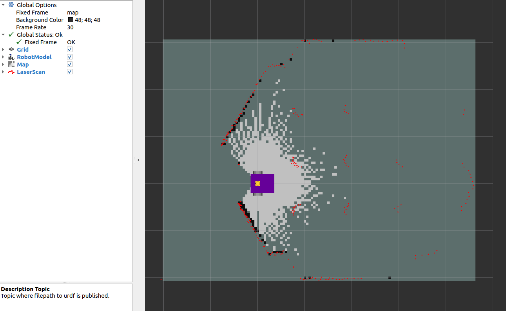

SLAM
========

Localisation in an existing map is great, but what about making a map?  A map could be generated from technical or architectural drawings, however, this is likely far more difficult compared to asking the robot to make the map for itself.

Simultaneous Localisation and Mapping (SLAM) has the robot traverse an environment, making a map and localising itself in that map.  Much like the cartographers of old, exploring unknown seas and coastlines, map makers had to both figure out where they were, and make a map at the same time.

There are various SLAM solutions available, however, the most accessible solutions utilise lidar and odometry.  Odometry for ground vehicles is typically the fusion of dead reckoning (also known as wheel odometry) and an inertial measurement unit (IMU).

.. NOTE::
    UAVs or aquatic vehicles, which can have external forces due to air/water currents, can't use dead reckoning, furthermore, converting propeller speeds into a twist prediction is also unreliable.  The result is that only ground vehicles readily have a reliable estimate for odometry.  For robots without reliable odometry (e.g. UAVs), typically an inertial measurement unit (IMU) is fused with visual or lidar data for SLAM.  As the robot can move in three dimensions, a 2D map is replaced with a 3D representation specific to the algorthim.  Using visual SLAM can be more computationally expensive than lidar scanmatching, which is a potential bottleneck for autonomy on lightweight UAVs.

In this tutorial, `SLAM Toolbox <https://github.com/SteveMacenski/slam_toolbox>`_ will be used, as it is the default offering for Nav2 and is very well maintained.  More information can be found in the `slides to a ROSCon 2019 <https://roscon.ros.org/2019/talks/roscon2019_slamtoolbox.pdf>`_ talk (or go watch it `on Vimeo <https://vimeo.com/378682207>`_).

Running the Launch File
-----------------------------

The launch file is much more simple than previous localisation, as the two map + localisation nodes are replaced with a single SLAM node.  The simulation is started, followed by SLAM, and finally RViz is used to visualise the output.  On line 31, a config file for RViz has been passed.  This conveniently sets up the topics being visualised as well as any other settings such as the camera angle.

.. literalinclude:: ../../ros_ws/src/example_gz_robot/launch/slam.launch.py
    :language: xml
    :linenos:

.. NOTE::
    Default values have been used for SLAM Toolbox.  This includes topics for the laserscan, names of global and odometry frames, along with many tuning parameters.  When using the ``async_slam_toolbox_node`` directly, these parameters can be overridden with a custom .yaml file, or by passing parameters/reampping topics to the node in the launch file.  Explore the `online_async_launch.py <https://github.com/SteveMacenski/slam_toolbox/blob/ros2/launch/online_async_launch.py>`_ file to investigate how this can be acheived for your robot.

Run the launch file with,

.. code-block:: console

    source ~/<YOUR_ROS_WS>/install/setup.bash
    ros2 launch example_gz_robot slam.launch.py

Intially, there is only a small portion of the map which has been generated (based on what the lidar can observe).

Using teleoperation (via ``teleop_twist_keyboard``), move the robot around to fill in the map.  The video below shows how SLAM periodically updates and fills in the map based on lidar observations, as well as keeping the pose of the robot well aligned with the world (as witnessed by the strong overlap between the lidar scan and the generated map).  However, pure rotations or fast velocities can lead to poor localisation.

.. image:: ../../figures/week09/slam_teleop.gif
  :width: 600
  :alt: Animation of robot driving around simulation environment, whilst building a map using SLAM.
  :align: center 

Using SLAM Maps
--------------------

SLAM Toolbox publishes on the ``/map`` topic, this can be used for 2D autonomous navigation using Nav2 (for path planning).  If you wish to use the map in the future (for localisation), there are two broad options:

1. Save the map using the ``map_saver`` node, and calling the service to save the map (example service call at the bottom of the `ros index page <https://index.ros.org/p/nav2_map_server/>`_, with more details on the `nav2 wiki <https://docs.nav2.org/configuration/packages/configuring-map-server.html#map-saver-parameters>`_).  This map image can be used with AMCL using the same approach as the previous localisation exercise.
2. Use the built in tools provided by SLAM Toolbox, this relies on saving the underlying pose-graph, rather than a rasterised image.  This is a more powerful approach, but takes more effort to setup.  You can find more information `on the docs <https://github.com/SteveMacenski/slam_toolbox?tab=readme-ov-file#localization>`_.