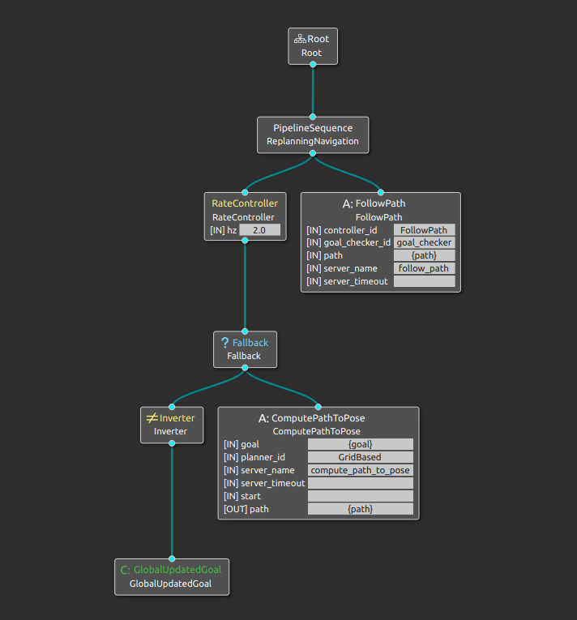
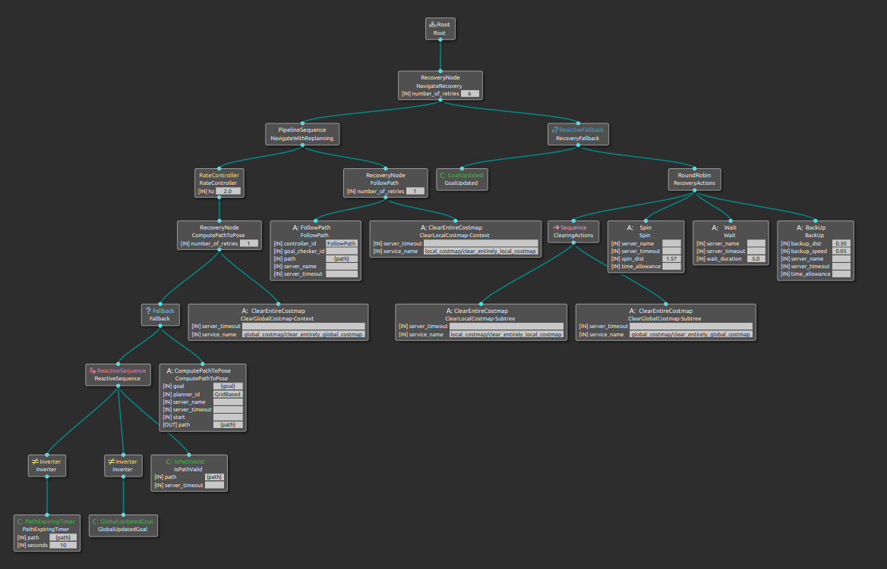

Adding Replanning
==================

Previously, we have only used control node (``Sequence``) and action nodes (``ComputePathToPose`` and ``FollowPath``).  Now we will need to leverage decorator and condition nodes.

Keep Replanning the Path
--------------------------

Start Groot and open your existing ``bt_simple_nav.xml`` file.  Change the ``Sequence`` control node for a ``PipelineSequence`` control node.  As the robot is navigating, the ``FollowPath`` node will return ``RUNNING``, we can use this time to check if a new path needs to be computed given the ``{goal}`` variable.  If we kept checking the path planning on every tick, we would likely bog down the system (computationally speaking), so we can use a ``RateController`` `decorator node <https://docs.nav2.org/behavior_trees/overview/nav2_specific_nodes.html#decorator-nodes>`_ to limit ticks to a set rate.  We will pick 2.0 Hz for this example.

.. Note::
    The ``PipelineSequence`` control node is similar to a normal sequence control node, however, if another leaf is ``RUNNING`` it reticks the previous leaves in the sequence. You can learn more on the `pipeline sequence docs <https://docs.nav2.org/behavior_trees/overview/nav2_specific_nodes.html#control-pipelinesequence>`_.

The behaviour tree should now look something like the image below.  The ``ComputePathToPose`` action node will be called every 2.0 Hz if ``FollowPath`` is ``RUNNING``.  Overwrite your existing ``bt_simple_nav.xml`` file with this new tree.

.. image:: ../../figures/week11/bt_withConstantReplanning.png
  :width: 800
  :alt: The ComputePathToPose action node is being recalled every 2.0 Hz if FollowPath is RUNNING.
  :align: center

Build and source your workspace, and start the launch file.

.. code-block:: console

    cd ~/MY_ROS_WS
    colcon build
    source install/setup.bash
    ros2 launch bt_demos bt_demo.launch.py

After giving the robot a goal pose, you should see the path being constantly replanned (at a rate of 2.0 Hz).  If a subsequent goal is given, then the path is recomputed and takes into account this new goal pose.

In a sense, we have completed our objective to have the path update if a new goal is given whilst enroute, but we can make it a bit more elegant.

Trigger Replanning of the Path
-------------------------------

Instead of constantly asking the path planner to recompute a path, let's instead only ask when a new goal is given.  When a new goal is given, the ``GlobalUpdatedGoal`` condition node will return ``SUCCESS``, sounds like something we can leverage.

We still only want to replan if the ``FollowPath`` action node is ``RUNNING``, so we can keep the ``PipelineSequence`` but modify the ``ComputePathToPose`` portion to happen in the event of a new goal.

A Fallback control node will work nicely in this instance.  A fallback node will only move onto the next leaf if the first one fails.  If we make the first leaf a check that a new goal has been given, then we can move on to planning a path.

The ``GlobalUpdatedGoal`` will only return a ``SUCCESS`` with a new goal, therefore, we need to convert that into a ``FAILURE`` to trigger the path planning.  An ``Inverter`` decorator node solves this.

This likely all sounds confusing, so let's take a look at the tree in Groot and figure out the conditions.

Let us breakdown the steps in this behaviour tree in the "normal" case (goal is given, the robot traverses to that goal).

  1. A new goal is requested - start on the left hand side of the tree - ``GlobalUpdatedGoal`` via ``Inverter`` returns ``FAILURE``
  2. This ``FAILURE`` triggers the Fallback control node to tick ``ComputePathToPose`` - this returns ``SUCCESS``
  3. The PipelineSequence control node moves over to ``FollowPath``, returning ``RUNNING`` whilst the robot is moving
  4. The robot reaches the goal, ``FollowPath`` returns ``SUCCESS`` and the behaviour tree is completed

Now let's consider a replanning situation, where a new goal has been provided when ``FollowPath`` is returning ``RUNNING``

  1. The PipelineSequence still ticks the RateController whilst the robot is moving
  2. Every 2.0 Hz, the fallback node is ticked
  3. With no new goal, ``GlobalUpdatedGoal`` via the ``Inverter`` returns ``SUCCESS`` and the fallback node returns ``SUCCESS`` without moving on to the ``ComputePathToPose`` node
  4. A new goal has been given since the last tick, ``GlobalUpdatedGoal`` via the ``Inverter`` returns ``FAILURE``, this triggers the fallback node to query ``ComputePathToPose`` and a new path is calculated
  5. As ``FollowPath`` uses the Blackboard variable ``{path}``, this now reflects the new goal and the robot continues to navigate

Modify your ``bt_simple_nav.xml`` file to replicate the behaviour tree in the above image.  You may use Groot or modify the xml tags manually.  Build and source your workspace, and start the launch file.

.. code-block:: console

    cd ~/MY_ROS_WS
    colcon build
    source install/setup.bash
    ros2 launch bt_demos bt_demo.launch.py

Running the simulation and giving the robot a goal, it will navigate to the goal but is not constantly replanning the path.  Only if you give the robot a new goal whilst it is navigating will the system replan the path.  This is much less computationally strenuous than our previous fixed rate replanning (imagine trying to calculate paths for a huge warehouse at a high rate!).

Recovery Behaviours
--------------------

Recovery behaviours are meant to be called when the robot gets in trouble.  The robot should stop trying to navigate, sort itself out, then try to carry on.

The image below is the `nav_to_pose_with_consistent_replanning_and_if_path_becomes_invalid <https://github.com/ros-planning/navigation2/blob/humble/nav2_bt_navigator/behavior_trees/nav_to_pose_with_consistent_replanning_and_if_path_becomes_invalid.xml>`_ behaviour tree from Nav2.  The left hand side of the recovery node called "NavigateRecovery" is essentially our simple replanning tree from above, with some additional checks (for example, in ``bt_simple_nav.xml`` it is assumed our ``ComputePathToPose`` will always succeed - not very robust).

The right hand side completely handles recovery behaviours.  There are four primary actions the behaviour tree tries to take: Clear Costmaps, Spin, Wait, BackUp.  The ``RoundRobin`` control node acts like a Sequence , trying them all in turn but has `extra conditions <https://docs.nav2.org/behavior_trees/overview/nav2_specific_nodes.html#control-roundrobin>`_.  Once the right hand side returns ``SUCCESS`` the RecoveryNode will retry to perform the left hand side navigation.  The recovery node is also slightly special, please `reads the docs <https://docs.nav2.org/behavior_trees/overview/nav2_specific_nodes.html#control-recovery>`_ for more information.

By expanding trees, we can provide more intricate behaviours for our robots.  They can take a fair amount of head scratching to read and to write, but the best thing is they are simple to modify and iterate upon.

