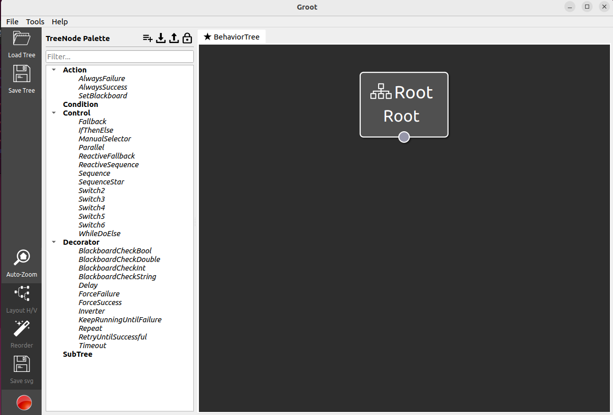

Investigating Behaviour Trees with Groot
================================================

Ensuring you have sourced the workspace where the groot package has been compiled, in a terminal session run the following:

.. code-block:: console

    ros2 run groot Groot

This should launch a GUI session.  Select ``Editor`` followed by ``START``, bringing up a window similar to the picture below.


.. image:: ../../figures/groot_launch.png
  :width: 600
  :alt: Launching Groot from command line.




Inspect Existing Behaviour Trees
-----------------------------------

The navigation stack already has a bunch of behaviour trees we can begin to unpick.  Let us use Groot to help visualise how they are constructed.

Firstly, Groot does not know about the Nav2 nodes (Action, Condition, Control, Decorator).  If it can not understand these nodes, then it will fail to read in a .xml file.  Load the existing Nav2 palette from the nav2_behavior_tree package found in ``/opt/ros/humble/share/nav2_behavior_tree/nav2_tree_nodes.xml``, the figures below document the steps.

.. image:: ../../figures/groot_load_palette_01.png
  :width: 600
  :alt: Select "Load Palette".

.. image:: ../../figures/groot_load_palette_02.png
  :width: 600
  :alt: Select "Other locations/computer".


.. image:: ../../figures/groot_load_palette_03.png
  :width: 600
  :alt: Navigate to the folder /opt/ros/humble/share/nav2_behavior_tree/ and select the nav2_tree_nodes.xml file.


Example Behaviour Tree 0
```````````````````````````

Download the first example behaviour tree |bt_example_0.xml|, which is a copy of the `nav2_bt_navigator odometry_calibration.xml <https://github.com/ros-planning/navigation2/blob/humble/nav2_bt_navigator/behavior_trees/odometry_calibration.xml>`_.

.. |bt_example_0.xml| replace::
   :download:`bt_example_0.xml <../../ros_ws/src/bt_demos/behavior_tree_xml/bt_example_0.xml>`

Within the Groot GUI, select "Load Tree" from the upper left side.  When Groot asks you "Clear Palette?", select "No", we wish to keep all the definitions of nodes from Nav2 we just loaded.

.. image:: ../../figures/bt_odometry_calibration.png
  :width: 600
  :alt: The Nav2 BT "odometry_calibration.xml" as viewed in Groot


This behaviour tree consists of a simple ``Sequence`` control node, which simply drives forward 2.0 m, performs a positive quarter turn and repeats this a total of four times to hopefully have the robot finish where it started.  However, the ``Sequence`` control node is itself a child of the ``Repeat`` decorator node, therefore, the entire sequence attempts to repeat three times.  This example is really on the border of what could be hardcoded in a normal ROS node (with a Twist publisher), but is a super simple example to show what the system will do.

By inspecting the .xml file, with the visual description as a reference, it is possible to understand how the .xml files are structured.

.. literalinclude:: ../../ros_ws/src/bt_demos/behavior_tree_xml/bt_example_0.xml
   :language: xml
   :linenos:

Inside the sequence open and closing tags, are the four sets of ``DriveOnHeading`` followed by ``Spin``.  The ``Sequence`` tags (called "Drive in a square") are inside the opening ``<Repeat>`` and closing ``</Repeat>`` tags.  Not impossible to read, but perhaps more difficult to grasp compared to a visual representation.

Example Behaviour Tree 1
```````````````````````````

Download the behaviour tree |bt_example_1.xml|, which is a copy of the `nav2_bt_navigator navigate_to_pose_w_replanning_and_recovery.xml <https://github.com/ros-planning/navigation2/blob/humble/nav2_bt_navigator/behavior_trees/navigate_to_pose_w_replanning_and_recovery.xml>`_.

.. |bt_example_1.xml| replace::
   :download:`bt_example_1.xml <../../ros_ws/src/bt_demos/behavior_tree_xml/bt_example_1.xml>`

.. image:: ../../figures/navigate_to_pose_w_replanning_and_recovery.png
  :width: 600
  :alt: The Nav2 BT "navigate_to_pose_w_replanning_and_recovery.xml" as viewed in Groot

As you can see, already this behaviour tree is getting pretty complicated.  The remainder of this tutorial will be building a similar behaviour tree from the ground up, hopefully getting a feeling of how behaviour trees grow as we add more complexity.

