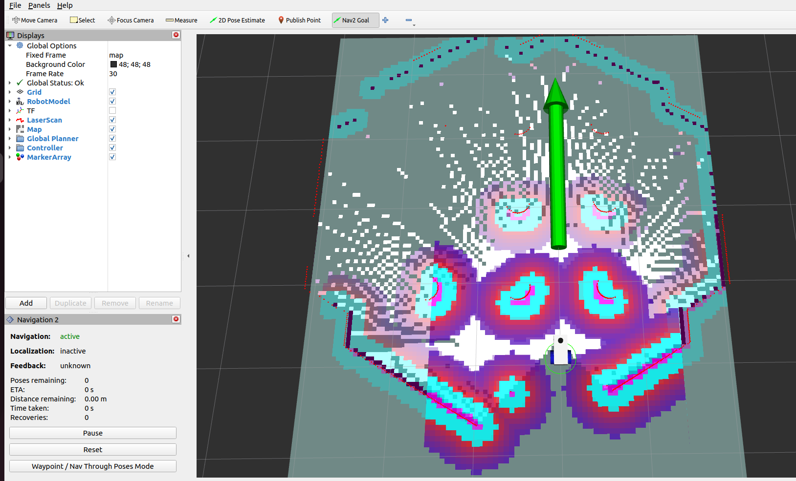

Using a Custom Behaviour Tree
===============================

Using the existing |gz_example_robot_description.zip| simulation, it is possible to select the desired behaviour tree in the launch file.

.. |gz_example_robot_description.zip| replace::
   :download:`gz_example_robot_description.zip <../../ros_ws/src/gz_example_robot_description.zip>`

Prep Work
------------

Download the three necessary configuration .yaml files and add them to the ``bt_demos/config`` directory.  These should be identical to the config files used in the previous path planning and navigation tutorials.

- |bt_nav.yaml|
- |controller.yaml|
- |planner.yaml|

.. |bt_nav.yaml| replace::
   :download:`bt_nav.yaml <../../ros_ws/src/bt_demos/config/bt_nav.yaml>`

.. |controller.yaml| replace::
   :download:`controller.yaml <../../ros_ws/src/bt_demos/config/controller.yaml>`

.. |planner.yaml| replace::
   :download:`planner.yaml <../../ros_ws/src/bt_demos/config/planner.yaml>`

Download the example launch file |bt_demo.launch.py|, and place it in the ``bt_demos/launch`` directory.

.. |bt_demo.launch.py| replace::
   :download:`bt_demo.launch.py <../../ros_ws/src/bt_demos/launch/bt_demo.launch.py>`

In the code block below, it is highlighted the changes made to accept a new behaviour tree.  We pass as an argument, the path to the .xml file we desire.

.. literalinclude:: ../../ros_ws/src/bt_demos/launch/bt_demo.launch.py
   :language: python
   :linenos:
   :emphasize-lines: 17,18,53

.. note::
    There are two behaviour trees available to the Nav2 Navigation Stack, ``nav_to_pose`` and ``nav_through_poses``.  The former accepts only a single goal, the latter accepts a list of goals.  So far, we have only been interested in the single goal ``nav_to_pose`` behaviour tree.

Run The Launch File
---------------------

Navigate to the workspace you are working in and build and source as usual.  Then run our new launch file.

.. code-block:: console

    cd ~/MY_ROS_WS
    colcon build
    source install/setup.bash
    ros2 launch bt_demos bt_demo.launch.py

The launch file will start a simulation world, with a robot, as well as RVIZ and the navigation stack.

Send A Goal Command
---------------------

Using the Nav2 Goal functionality in RVIZ, set a goal ahead of the robot.  It should start traversing to the goal pose!

.. image:: ../../figures/week11/rviz_simplebt_nav2.png
  :width: 800
  :alt: Simulated robot navigating to the goal.
  :align: center  

There are some characteristics which are not great about this behaviour tree.  If the robot has completed a navigation task, then when given a new goal, it will continue to compute a path and navigate to the goal.  If the goal is given *during* navigation however, then the behaviour tree (and the robot) ignore it entirely.  During the next step, we will add ``replanning`` to the behaviour tree.

